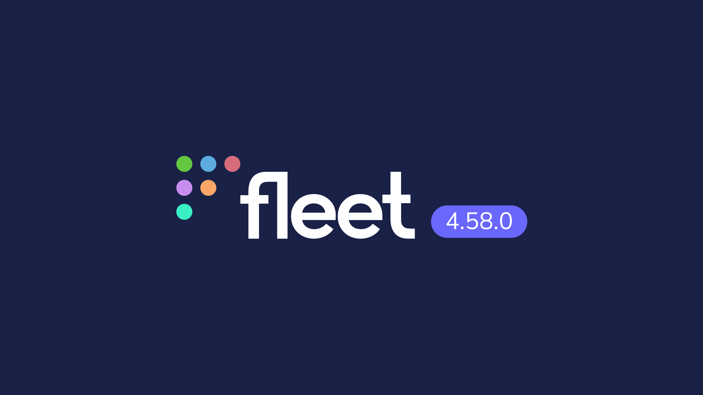

# Fleet 4.58.0 | Software improvements, policy automation, GitLab support.

Fleet 4.58.0 is live. Check out the full [changelog](https://github.com/fleetdm/fleet/releases/tag/fleet-v4.58.0) or continue reading to get the highlights.
For upgrade instructions, see our [upgrade guide](https://fleetdm.com/docs/deploying/upgrading-fleet) in the Fleet docs.

## Highlights
* Policy failure: execute script
* Fleet-maintained apps for macOS
* Sequoia firewall status
* RPM package support

### Policy failure: execute script

Fleet now supports automatically running a script when a policy fails, providing a more proactive approach to policy enforcement and remediation. This feature allows administrators to define scripts that will be executed whenever a device fails to meet a specified policy, enabling automated corrective actions to be taken immediately. For example, if a security policy detects a misconfiguration or outdated software version, a script can be triggered to fix the issue or notify the user. This capability helps streamline maintaining compliance and ensures that devices are quickly brought back into alignment with organizational standards, reducing the need for manual intervention and enhancing overall fleet management efficiency.

### Fleet-maintained apps for macOS

Fleet now supports Fleet-maintained apps on macOS, making it easier for admins to deploy and manage commonly used applications across their fleet. This feature allows IT teams to quickly install and update a curated selection of essential apps maintained by Fleet, ensuring that these applications are always up-to-date and secure. By simplifying managing software on macOS devices, Fleet-maintained apps help organizations maintain consistency in their software deployments, improve security by ensuring software is current, and reduce the administrative burden of manually managing application updates. This update underscores Fleet's commitment to providing user-friendly solutions for efficient and secure device management.

### Sequoia firewall status

With macOS 15 Sequoia, the existing `alf` table in osquery no longer returns firewall status results due to changes in how firewall settings are structured in the new OS. To address this, Fleet has added support for reporting firewall status on macOS 15, ensuring administrators can monitor and manage firewall configurations across their devices. This update helps maintain visibility into critical security settings even as Apple introduces changes to macOS, allowing IT teams to ensure compliance with security policies and proactively address any firewall configuration issues. This enhancement reflects Fleet's commitment to adapting to evolving platform changes while providing robust security and monitoring capabilities across all supported devices.

### RPM package support

Fleet now supports RPM package installation on Linux distributions such as Fedora and Red Hat, significantly expanding its software management capabilities. With this enhancement, IT admins can deploy and manage RPM packages directly from Fleet, streamlining software installation, updating, and maintenance across Linux hosts. This addition enables organizations to leverage Fleet for consistent software management across a broader range of Linux environments, improving operational efficiency and simplifying package deployment workflows. By supporting RPM packages, Fleet continues to enhance its flexibility and adaptability in managing diverse device fleets.

## Changes

**NOTE:** Beginning with Fleet v4.55.0, Fleet no longer supports MySQL 5.7 because it has reached [end of life](https://mattermost.com/blog/mysql-5-7-reached-eol-upgrade-to-mysql-8-x-today/#:~:text=In%20October%202023%2C%20MySQL%205.7,to%20upgrade%20to%20MySQL%208.). The minimum version supported is MySQL 8.0.36.

**Endpoint Operations**

## Ready to upgrade?

Visit our [Upgrade guide](https://fleetdm.com/docs/deploying/upgrading-fleet) in the Fleet docs for instructions on updating to Fleet 4.58.0.

<meta name="category" value="releases">
<meta name="authorFullName" value="JD Strong">
<meta name="authorGitHubUsername" value="spokanemac">
<meta name="publishedOn" value="2024-09-23">
<meta name="articleTitle" value="Fleet 4.58.0 | Software improvements, policy automation, GitLab support.">
<meta name="articleImageUrl" value="../website/assets/images/articles/fleet-4.58.0-1600x900@2x.png">
